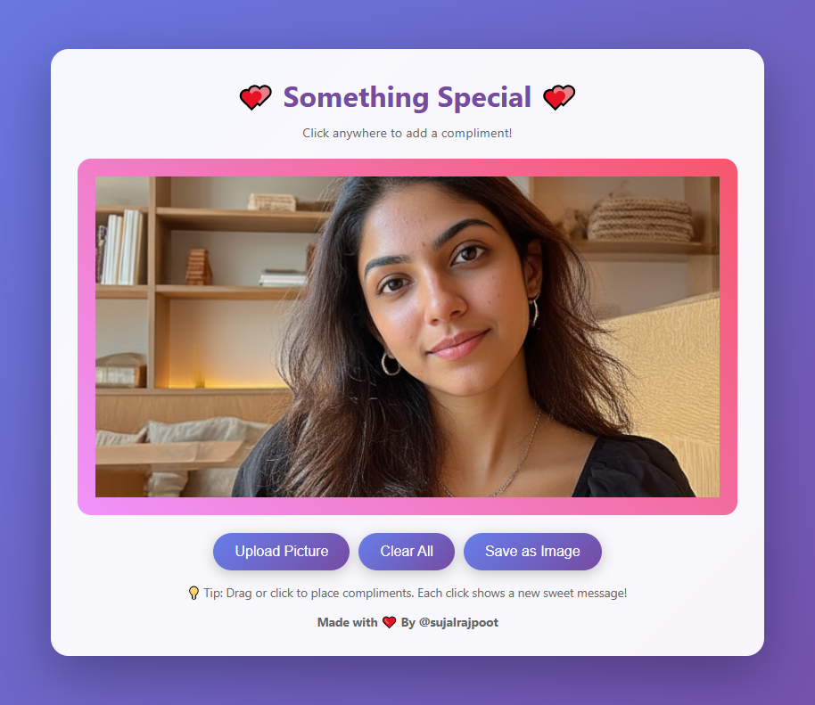
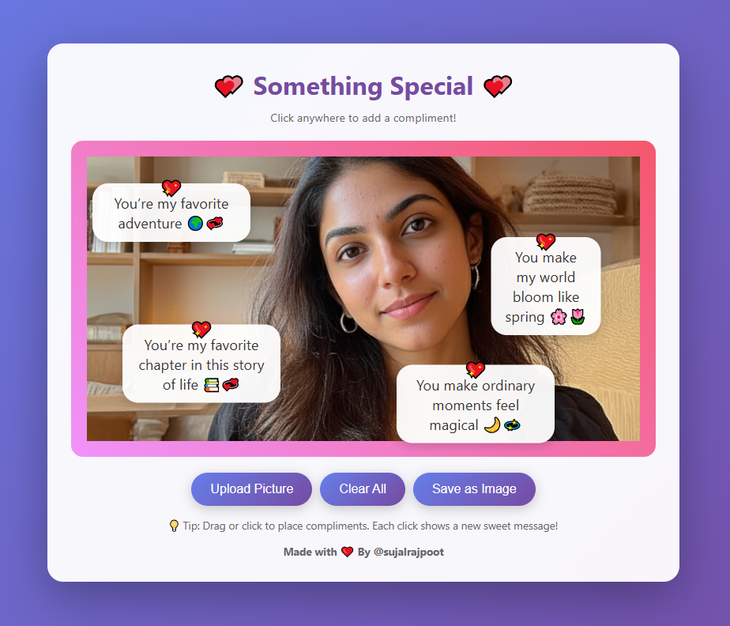

<h1 align="center">💖 <b>Interactive Compliment App for Your Crush</b> 💖</h1>

<div align="center">


**A romantic, interactive web application to shower your special someone with compliments! 💖**

[Features](#-features) • [Demo](#-demo) • [Installation](#-installation) • [Usage](#-usage) • [How It Works](#-how-it-works) • [Contributing](#-contributing)

</div>

---

## 📖 Description

Ever wanted to express your feelings in a creative and memorable way? This Interactive Compliment App lets you upload a photo of your crush and place sweet, heartfelt compliments anywhere on the image with just a click! 

Perfect for:
- 💌 Romantic gestures
- 🎂 Birthday surprises
- 💝 Valentine's Day gifts
- 🎉 Anniversary celebrations
- 😊 Just making someone's day special

The app features 20 unique compliments that appear with beautiful animations, and you can save the final masterpiece to share with that special someone!

---

## ✨ Features

### 🎨 Core Features
- **📸 Photo Upload**: Upload any image (JPG, PNG, GIF, etc.)
- **✨ Interactive Compliments**: Click anywhere to place romantic messages
- **🎲 Smart Randomization**: Never see the same compliment twice until all 20 are used
- **💫 Beautiful Animations**: Smooth fade-in effects with floating hearts
- **💾 Save & Share**: Download your creation as a PNG image
- **🧹 Clear All**: Start fresh with one click
- **📱 Fully Responsive**: Works perfectly on mobile, tablet, and desktop

### 🎭 Design Features
- **🌈 Gradient Backgrounds**: Eye-catching purple gradient theme
- **🔮 Glassmorphism Effects**: Modern, frosted glass design
- **💖 Emoji Accents**: Heart emojis add extra charm
- **🎯 Intuitive UI**: Clean, user-friendly interface
- **⚡ No Dependencies**: Pure HTML, CSS, and JavaScript - no frameworks needed!

---

## 🎬 Demo

### Before
<p align="center">
  
</p>

### After
<p align="center">
  
</p>

---

## 🚀 Installation

### Option 1: Direct Download
1. **Download** the HTML file
2. **Save it** as `index.html` on your computer
3. **Double-click** to open in your browser
4. **Done!** Start adding compliments! 🎉

### Option 2: Clone Repository
```bash
# Clone this repository
git clone https://github.com/sujalrajpoot/Interactive-Compliment-App-for-Your-Crush.git

# Navigate to project directory
cd Interactive-Compliment-App-for-Your-Crush

# Open in browser
open index.html
# or
start index.html  # Windows
```

### Option 3: Host Online
Deploy on any static hosting service:
- **GitHub Pages** (Free)
- **Netlify** (Free)
- **Vercel** (Free)
- **Firebase Hosting** (Free)

---

## 📱 Usage

### Step-by-Step Guide

#### 1️⃣ Upload a Photo
Click the **"Upload Picture"** button and select a photo of your crush from your device.

#### 2️⃣ Add Compliments
Click anywhere on the image to place a compliment bubble. Each click shows a different sweet message!

#### 3️⃣ Position Perfectly
Keep clicking to add more compliments in different locations. Place them near:
- 😊 Their smile
- 👀 Their eyes
- 💇 Their hair
- ✨ Anywhere that makes them feel special!

#### 4️⃣ Save Your Creation
Click **"Save as Image"** to download your masterpiece as a PNG file.

#### 5️⃣ Share the Love
Send the image to your crush via:
- 💬 Text message
- 📧 Email
- 📱 Social media DM
- 🖨️ Print it out and gift it!

### Pro Tips 💡
- **Use high-quality photos** for best results
- **Don't overcrowd** - 5-10 compliments look best
- **Strategic placement** - put compliments near features you love
- **Take your time** - you can clear and restart anytime!

---

## 🔧 How It Works

### Technical Architecture

#### 🎨 Frontend Structure
```
┌─────────────────────────────────┐
│     HTML Structure              │
│  ┌───────────────────────────┐  │
│  │   Container               │  │
│  │  ┌─────────────────────┐  │  │
│  │  │  Image Container    │  │  │
│  │  │  (Upload + Display) │  │  │
│  │  └─────────────────────┘  │  │
│  │  ┌─────────────────────┐  │  │
│  │  │  Control Buttons    │  │  │
│  │  └─────────────────────┘  │  │
│  └───────────────────────────┘  │
└─────────────────────────────────┘
```

#### 💾 Data Flow
1. **Image Upload** → FileReader API → Base64 conversion → Display
2. **Click Event** → Capture coordinates → Select random compliment → Render bubble
3. **Save Function** → HTML5 Canvas → Draw image + compliments → Export PNG

#### 🧠 Smart Compliment System
```javascript
// Prevents repetition until all compliments are used
if (usedCompliments.length === compliments.length) {
    usedCompliments = []; // Reset pool
}
const availableCompliments = compliments.filter(
    c => !usedCompliments.includes(c)
);
```

#### 🎨 Canvas Rendering
When saving, the app:
1. Creates an HTML5 Canvas element
2. Draws the uploaded image
3. Renders each compliment bubble with:
   - Rounded rectangle background
   - Text centered inside
   - Heart emoji on top
4. Converts canvas to downloadable PNG

### 🗂️ File Structure
```
Interactive-Compliment-App-for-Your-Crush/
│
├── index.html          # 🌸 Main single-page web app
│   ├── HTML Section    # Defines the app structure (buttons, input fields, compliment display area)
│   ├── CSS Section     # Embedded styling for layout, colors, fonts, and animations
│   └── JavaScript      # Embedded logic for handling user input, generating compliments, and interactivity
│
├── After.png           # 📷 Screenshot showing the app after generating a compliment (output example)
├── Before.png          # 📷 Screenshot showing the app before any interaction (initial state)
│
├── LICENSE             # 📜 Open-source license file defining usage and distribution terms
└── README.md           # 📘 Project documentation — includes setup instructions, features, and usage guide
```

---

## 💖 How It Can Help Users

### 🎯 For Romantic Relationships
- **Express feelings** you might be too shy to say
- **Create memorable gifts** that show effort and creativity
- **Stand out** from generic cards and messages
- **Document special moments** with personalized touches

### 🎓 For Personal Growth
- **Learn web development** basics (HTML, CSS, JavaScript)
- **Understand File APIs** and image manipulation
- **Practice DOM manipulation** and event handling
- **Explore Canvas API** for graphics programming

### 👥 For Social Connection
- **Strengthen relationships** through thoughtful gestures
- **Spread positivity** and make people feel valued
- **Create shareable content** for social media
- **Build confidence** in expressing appreciation

### 🎨 For Creativity
- **Combine technology with emotion** in unique ways
- **Experiment with design** and user experience
- **Customize messages** to match your style
- **Create art** that's both visual and meaningful

---

## 🤝 Contributing

We'd love your help making this app even more amazing! Here's how you can contribute:

### 🌟 Ways to Contribute

#### 1. Add More Compliments
Edit the `compliments` array to include more sweet messages:
```javascript
const compliments = [
    "Your smile lights up my world",
    "You're absolutely stunning",
    // Add your own here! 💕
];
```

#### 2. Enhance Features
Some ideas:
- 🎵 Add background music option
- 🎨 Multiple color theme choices
- 💬 Custom compliment input field
- 🌟 Different emoji options
- 🎭 Animation style selector
- 📏 Adjustable compliment bubble sizes

#### 3. Improve Design
- 🎨 Create alternative color schemes
- 📱 Enhance mobile responsiveness
- ✨ Add more animation effects
- 🖼️ Improve image filters/effects

#### 4. Fix Bugs
Found a bug? Please report it or submit a fix!

### 📝 Contribution Guidelines

1. **Fork** the repository
2. **Create** a feature branch (`git checkout -b feature/AmazingFeature`)
3. **Commit** your changes (`git commit -m 'Add some AmazingFeature'`)
4. **Push** to the branch (`git push origin feature/AmazingFeature`)
5. **Open** a Pull Request

### 💬 Code of Conduct
- Be respectful and inclusive
- Provide constructive feedback
- Keep compliments positive and appropriate
- No offensive or inappropriate content

---

## 🎁 Bonus Features Ideas

Want to make this even better? Here are some ideas:

### 🚀 Advanced Features
- **🔐 Save to Cloud**: Store creations in the cloud
- **🤝 Collaboration Mode**: Multiple people add compliments
- **📅 Schedule Delivery**: Auto-send on specific dates
- **🎬 Video Support**: Add compliments to videos
- **🗣️ Voice Messages**: Record audio compliments
- **🌍 Multi-language**: Support multiple languages

### 🎨 Creative Additions
- **Stickers & GIFs**: Add animated elements
- **Filters & Effects**: Instagram-style photo filters
- **Frames & Borders**: Decorative borders
- **Text Styling**: Different fonts and colors
- **Background Music**: Romantic music player
- **Template Gallery**: Pre-made compliment sets

### 📊 Analytics Features
- **Compliment Counter**: Track how many compliments added
- **Popular Compliments**: See most-used messages
- **Activity Log**: View compliment history
- **Sharing Stats**: Track how many times shared

---

## 🛠️ Tech Stack

| Technology | Purpose | Why? |
|------------|---------|------|
|  | Structure | Clean, semantic markup |
|  | Styling | Modern gradients & animations |
|  | Interactivity | Vanilla JS - no dependencies! |
|  | Image Export | High-quality PNG generation |
|  | Image Upload | Client-side file handling |

---

## 📜 License

This project is licensed under the **MIT License** - feel free to use it for personal or commercial projects!

```
MIT License

Copyright (c) 2025 Sujal Rajpoot

Permission is hereby granted, free of charge, to any person obtaining a copy
of this software and associated documentation files (the "Software"), to deal
in the Software without restriction, including without limitation the rights
to use, copy, modify, merge, publish, distribute, sublicense, and/or sell
copies of the Software...
```

---

## 🙏 Acknowledgments

- 💖 Inspired by love and the desire to make people smile
- 🎨 Design influenced by modern glassmorphism trends
- 🌟 Built with passion for helping people express feelings
- 💝 Special thanks to everyone who uses this to spread joy!

---

## 📞 Contact & Support

### 💌 Questions or Feedback?
* **📸 Instagram**: [@sujal_rajpoot.py](https://instagram.com/sujal_rajpoot.py)
* **🐙 GitHub**: [@sujalrajpoot](https://github.com/sujalrajpoot)

### 🐛 Found a Bug?
Please [open an issue](https://github.com/sujalrajpoot/Interactive-Compliment-App-for-Your-Crush/issues) with:
- Description of the bug
- Steps to reproduce
- Expected vs actual behavior
- Screenshots (if applicable)

### 💡 Feature Request?
We'd love to hear your ideas! [Submit a feature request](https://github.com/sujalrajpoot/Interactive-Compliment-App-for-Your-Crush/issues/new) and let us know what you'd like to see!

---

## 🌟 Show Your Support

If this project helped you express your feelings or made someone smile, please consider:

- ⭐ **Starring** this repository
- 🍴 **Forking** it to create your own version
- 📢 **Sharing** it with friends who might need it
- 💖 **Using** it to make someone's day special!

---

<div align="center">

### 💕 Made with Love and Code 💕 By @sujalrajpoot

**Remember**: The best compliments come from the heart! ❤️

</div>

---

### Inspiration
- [Dribbble - Romance UI Designs](https://dribbble.com/tags/romance)
- [CodePen - Valentine's Day Animations](https://codepen.io/tag/valentines)

---

<div align="center">

**⚡ Version 1.0.0** | **Last Updated: November 2025**

</div>
